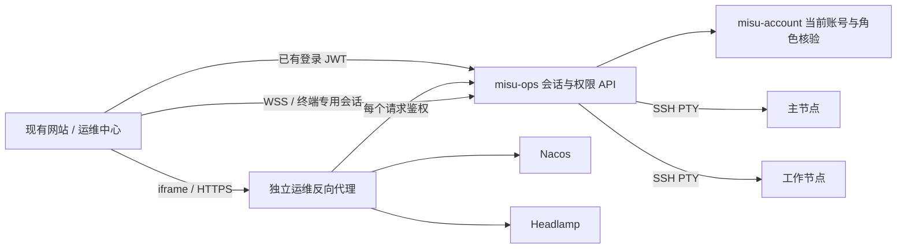

# 网站运维中心方案（待评审）

日期：2026-09-09。范围：需求与技术方案，不实施、不发布。

## 目标与实际环境

在现有网站增加“运维中心”，超级管理员可以在页面内使用 Nacos、Headlamp 和两台节点的交互式 SSH 终端。后端新增独立模块、镜像、Deployment、Service，独立升级和回滚。

本次只读核验：

| 项目 | 已确认现状 |
| --- | --- |
| 后端 | Java 17、Spring Boot 3.2.5、Spring Cloud；公共 JWT 安全模块 |
| 前端 | Vue 3、Element Plus、Vite；桌面 SideNav、移动 TabBar |
| 权限 | USER、ADMIN、FILE_ADMIN；运维中心仅 ADMIN |
| Nacos | `http://10.8.0.26:8848/nacos/`，HTTP 200；镜像 `nacos/nacos-server:v2.5.0` |
| 集群控制台 | `http://10.8.0.26:30087/c/main/pods`，HTTP 200；产品为 Headlamp，位于 kuboard 命名空间，镜像标签 latest，确切版本待核验 |
| 集群内入口 | `nacos.misu-server.svc.cluster.local:8848`、`headlamp.kuboard.svc.cluster.local:80` |
| SSH | 用户提供的临时密钥能登录 `root@10.8.0.1` 和 `root@10.8.0.26` |
| 发布 | CLAUDE.md 指明 push master 自动部署；新模块必须加入 CI 构建、路径筛选及部署清单 |

核验仅包括代码、集群服务/镜像清单、页面响应头与 Headlamp HTML。未登录控制台，未更改配置，未验证浏览器嵌入、Pod exec、配置写入；`192.168.50.227` 与工作节点的网卡映射未额外核验。

## 页面与第一版范围

新增 `/ops` 路由，桌面侧栏与移动菜单提供同一个“运维中心”入口，仅 ADMIN 可见。

- Nacos：页面内嵌原控制台，使用原有配置、服务管理能力。
- Kubernetes：内嵌 Headlamp，默认进入 `/c/main/pods`，保留资源浏览、日志与容器终端能力。
- SSH：预置“主节点 10.8.0.1”和“工作节点 10.8.0.26”；支持双节点标签切换、连接/断开、终端缩放、复制粘贴、Ctrl/C、Tab、方向键、vim/top 等 PTY 交互。
- 页面显示连接中、已连接、权限失效、目标不可达；提供重试与全屏。移动端提供 Esc、Ctrl、Tab 等辅助键，控制台允许横向滚动/全屏，不能保证上游页面本身适配手机。
- 第一版保留 Nacos 和 Headlamp 原有登录，在内嵌页面内完成，不承诺网站登录自动等同于上游登录。
- 第一版不做文件传输、批量命令、定时脚本、自动重放命令、会话录像；刷新 SSH 页会断开，重连创建新会话。

## 推荐架构

逻辑组成：`misu-ops` Java 服务负责授权、会话、节点配置、审计及 SSH 桥接；专用 Nginx 负责原控制台 HTTP/WebSocket 代理。可以部署为同一 Deployment 的两个容器，作为一个运维单元发布；Java 服务和代理容器均通过集群内部访问上游，不给它们新增公开 NodePort。主网站新增轻量页面和 API 封装。

推荐使用已配置的独立 HTTPS 子域名 `ops-nacos.misu.chat` 和 `ops-k8s.misu.chat`，网站内用 iframe 展示。独立域名可保持 Headlamp 根路径和 Nacos `/nacos/`，减少静态资源、API、重定向及存储冲突。浏览器只访问网站 HTTPS 入口，不直接访问 10.8.0.x。

若不增加域名，也可以用 `/ops/proxy/nacos/`、`/ops/proxy/headlamp/`，但必须先验证上游 base URL 与所有资源路径，并接受与主站共享 origin 的信任边界。Headlamp 官方支持 base URL，但需要匹配配置与探针，不能仅重写 HTML。第一版优先独立子域方案。

## 身份、会话与权限

### 超级管理员定义

沿用现有 `ADMIN` 作为运维中心的超级管理员角色，不新增 `SUPER_ADMIN`，也不建立普通 ADMIN 与超级管理员的权限层级。

除菜单隐藏和路由守卫，API、代理页面、静态资源、上游 API、WebSocket 握手都必须校验 `ADMIN`。未登录返回 401；登录但没有 ADMIN 返回 403。拒绝任意地址转发，浏览器仅提交服务 ID 或节点 ID，服务器解析固定白名单。

### 浏览器会话接入

1. 主站通过现有 axios 实例携带 JWT 请求 `POST /ops/api/launch-tickets`，后端实时核验账号状态及 ADMIN，生成一次性、短时、绑定用户和目标的票据（建议 30 秒）。
2. 通过定向表单 POST 将票据送到目标路径内的固定会话入口；兑换后设置 host-only、HttpOnly、Secure、SameSite=None 的独立运维 Cookie，并将 Path 限定为 `/nacos/` 或 `/ops/headlamp/`，再跳转到固定上游页面。Cookie 不含上游凭据或站点 JWT；票据不放查询字符串或日志。
3. 代理每个请求检查运维会话，向上游仅转发必要头和上游自己的登录状态；清除主站凭据和浏览器伪造的代理身份头。
4. Cookie 鉴权带来的写请求需校验 Origin/Referer 与 CSRF 防护；WebSocket 严格校验 Origin、会话归属和有效期，不能直接沿用公共安全模块全局关闭 CSRF 的默认行为。
5. SSH 使用短时单次握手凭证，禁止 URL 中携带长期 JWT/SSH 密钥；日志脱敏。连接期间定期重新核验角色和账号状态（建议最多 30 秒），失效即关闭现有连接。新连接必须查当前权限，不能只相信旧 JWT 的角色快照。
6. 退出登录增加服务端运维会话撤销；目前前端 logOut 仅清 Cookie。建议空闲 15 分钟、最长 2 小时后重新验证；鉴权服务不可达时拒绝新会话，现有会话到核验期限关闭。

当前前端 Cookie 默认使用 `.misu.chat`，且 JavaScript 可读。**仅拆子域不能实现主站凭据隔离**：本次不做全局 host-only Cookie 迁移，避免影响现有 API 和媒体鉴权；`ops-nacos.misu.chat`、`ops-k8s.misu.chat` 与主站继续共享已有 `.misu.chat` 信任边界。运维代理必须清除浏览器发来的 `User-Token`、`User-Refresh-Token` 等主站凭据，并只接受配置的控制台 Host；运维会话使用独立 host-only、HttpOnly、Secure Cookie。后续若要彻底隔离主站凭据，另行设计受控登录交换并回归账号登录、刷新、退出。

### 上游认证

- Nacos 2.5.0 仍使用自己的权限体系，但运维入口由 Java 服务端使用只读 Kubernetes Secret 中的专用 Nacos 账号登录 `v1/auth/users/login`，按每个 ops session 缓存短时 `accessToken`，并通过内部代理注入 `Authorization: Bearer ...`。账号、密码和 token 均不进入浏览器、Cookie、URL 或日志；logout、撤销、角色失效和过期会清理 session 缓存，Nacos token 随其服务端 TTL 失效。
- Nacos 2.5.0 legacy console 前端在 `console-ui/src/pages/Login/Login.jsx` 看到 `localStorage.token` 会跳转首页，而 `console-ui/src/globalLib.js` 在 `login_page_enabled=false` 时不要求浏览器 token。sidecar 仅对经过 auth_request 的 `/nacos/v1/console/server/state` 将该字段从 `true` 改为 `false`，同时继续给每个上游请求注入服务端 Authorization；这是直接进入控制台所需的最小 bootstrap，不把短时上游 token 降级暴露给浏览器。
- Headlamp 第一版保留现有 Kubernetes 登录。后续若要免登录，先固定实际版本，验证该版本是否支持身份感知代理，再设计 Kubernetes 身份/RBAC 映射；主站 JWT 不能直接当 Kubernetes Token。
- 所有原有内网管理入口保持原有认证边界；本模块的 ADMIN 限制针对新增网站入口。若后续启用上游“信任代理免登录”，必须同时禁止未鉴权路径直接访问那个受信任实例，必要时单独部署 Headlamp 实例。

## 代理兼容性

本次首页响应未见 X-Frame-Options 或 CSP frame-ancestors；Nacos 有 `script-src 'self'`。这只说明首页响应未直接禁止 iframe，不代表所有登录/API 路径或浏览器行为已验证。

- 父页面 CSP frame-src 只允许指定运维域；控制台响应 frame-ancestors 只允许实际主站来源，保留上游其余 CSP。
- 检查 Location、Cookie Path/Domain、资源绝对路径、深链刷新，避免内网地址泄漏或登录循环。
- HTTP 代理透传必要方法、查询参数、请求体；WebSocket 配置 Upgrade、Connection、超时与心跳，流式日志避免响应缓冲。
- Nacos 需验证配置查看、编辑、发布、历史、导入导出；Headlamp 需验证资源列表、YAML、实时日志及 Pod exec。实际写操作验证使用测试命名空间/测试配置，发布后验收范围另定。

## SSH 与部署

- 前端采用 xterm.js；后端用维护中的 Java SSH 库（仓库已有 mwiede/JSch 依赖可评估），开启 PTY 并同步窗口尺寸。终端不是单条命令执行器。
- 固定两台节点、端口、账号与密钥引用；校验 SSH 主机指纹并固化 known_hosts，禁止关闭主机密钥校验。
- 用户提供的临时密钥只用于本次调研。生产使用单独的运维密钥，通过只读 Secret 挂载到 Java 容器，不能提交仓库或发给前端；运行容器本身无需 privileged、hostPID 或主机根目录挂载。
- 若按当前 root 使用习惯接入，终端拥有真实 root 权限；UI 确认框无法约束任意 shell 命令。可后续改专用运维用户加 sudo，第一版明确显示目标和账号。
- 首版单副本，初始资源预算建议 Java request 250m/256Mi、limit 1 CPU/768Mi，代理单独小额配额；属于待压测起点。断连清理 SSH 资源、设置并发上限，滚动升级会断开活跃终端。
- 新模块核心配置通过环境变量/ConfigMap/Secret 提供，不依赖 Nacos 启动；使用 Kubernetes Service DNS，避免 Nacos 故障时运维模块自身无法启动。账号鉴权仍依赖账号服务，整个集群故障时网站运维中心不可用，原 SSH 通道保留作故障恢复。
- ServiceAccount 默认不挂 Kubernetes Token；单纯反代原 Headlamp 不需要让 misu-ops 拥有集群管理权限。
- 审计记录用户、目标、会话起止、来源、结果及代理请求摘要；不记录密码、密钥、令牌和完整请求体。终端字节流不能可靠还原为完整命令审计，第一版不承诺会话录像或完整命令审计。

## 改动清单与推进顺序

| 部分 | 计划改动 |
| --- | --- |
| 新模块 | `misu-ops`、独立 Dockerfile、配置、会话/审计/SSH 服务 |
| 权限 | 沿用现有 ADMIN；当前身份核验及会话撤销 |
| 前端 | `/ops` 页面、SideNav、TabBar、路由守卫、axios API、xterm 组件 |
| 入口代理 | 专用运维 Nginx、HTTPS 域名/证书、iframe CSP、Cookie 和 WS 配置 |
| 部署 | 独立 Deployment/Service/ConfigMap/Secret 模板；集群 DNS、健康检查、资源与网络访问规则 |
| CI/CD | 根模块列表、新模块 paths-filter、Maven 构建、镜像构建/发布、清单下发；同时覆盖本地 release 脚本 |

1. 先做接入验证：固定 Headlamp 版本/摘要、确认实际网站域名和 HTTPS 入口、Cookie 使用范围；证明 iframe 登录、资源、日志和 WS 可用。
2. 实施授权和独立模块骨架：完成 ADMIN 的闭环保护、会话交换/撤销及两控制台代理。
3. 实施双节点 SSH：PTY、交互键、尺寸、断连、到期关闭、审计。
4. 验收发布：普通用户/ADMIN/FILE_ADMIN 均不能绕过访问；两控制台关键操作和 SSH 交互可用；1280×800 与 414×800 两种视口验证；部署、重启和回滚验证。

第一轮方案采用的默认决策：沿用 ADMIN；后端独立部署、前端集成现有网站；控制台优先独立子域内嵌；上游保留原登录；SSH 先覆盖现有两个节点。本人账号 ID、域名与长期密钥在实施配置时补齐。

本方案未创建业务代码、修改服务器或触发部署，未运行构建与功能测试。

## 依据

- 本地：CLAUDE.md、根 pom.xml、前端 package.json、UserRole.java、JwtAuthenticationFilter.java、UserServiceImpl.java、SideNav.vue、auth/token.js、auth/auth.js。
- 现场：SSH 执行 kubectl get deployments/services；工作节点 curl 两个用户指定控制台的响应头与 Headlamp HTML。
- [Headlamp base URL 与 origin 注意事项](https://headlamp.dev/docs/latest/installation/base-url/)
- [Headlamp 身份感知代理及 Kubernetes 认证](https://headlamp.dev/docs/latest/installation/in-cluster/identity-aware-proxy/)（当前官方文档，须与现场版本核对后使用）
- [Nginx WebSocket 代理](https://nginx.org/en/docs/http/websocket.html)
- [xterm.js 集成安全指南](https://xtermjs.org/docs/guides/security/)
